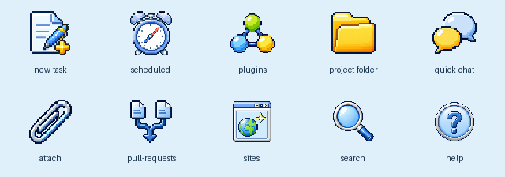

# Codex Native 2007

给 Codex Desktop 套上一层古早论坛 × 2007 桌面 IM 的皮肤，同时保留原生
功能和页面结构。



这不是换壳客户端，也不修改 Codex.app：它通过仅监听本机的 Chromium
调试接口，把 CSS 和轻量 DOM 装饰器注入官方客户端。主题菜单、用量快捷
查看、用户气泡、论坛帖子式回复、系统活动记录和输入框仍然建立在 Codex
原生交互上。

## 目前有些什么

- 经典蓝、樱桃牛奶、葡萄汽水、海盐橘子四套配色
- 分栏式 2007 桌面布局和早期论坛帖子样式
- 独立的用户气泡、企鹅头像、论坛操作栏与系统记录
- 输入框底部用量快捷查看，不与 Full access 菜单串联
- 原创像素工具栏图标和圆体菜单字体
- 一键恢复官方外观，不改应用包、不替换签名

## 安装

要求：

- macOS
- 官方 Codex Desktop（兼容 `Codex.app` 与部分时期使用的 `ChatGPT.app`）
- Node.js 22 或更高版本

```bash
git clone https://github.com/Shitsuten/codex-native-2007.git
cd codex-native-2007
./install.sh
```

安装完成后，双击桌面的 `Launch Codex Native 2007.command`。第一次启用时
会要求重启当前 Codex 窗口；请先保存输入框里还没发送的内容。

如果终端提示没有执行权限：

```bash
chmod +x install.sh uninstall.sh bin/*.sh commands/*.command
./install.sh
```

## 恢复与卸载

双击桌面的 `Restore Official Codex.command` 会移除当前页面里的皮肤并结束
监听进程。以后从原来的 Codex 图标启动，就是官方外观。

完整卸载：

```bash
./uninstall.sh
```

## 开发检查

```bash
npm run check
```

实机调试需要先由启动脚本打开 Codex，再向注入器提供本机调试端口和对应
browser ID。注入器只接受 loopback WebSocket 与 `app://` 页面。

## 项目来源

Codex Native 2007 是一套独立实现，不是其他 Codex 皮肤的 fork，也不以
第三方皮肤的代码或素材作为运行依赖。视觉方向来自用户提供的 2007 年代
桌面 IM 截图、早期中文论坛和 Windows XP 时代界面语言；参考截图不随仓库
分发。

这是非官方实验项目。Codex 更新 DOM 结构后，部分选择器可能需要随版本
调整。Codex、OpenAI 及其他文中提及的产品名称归各自权利人所有。

代码采用 [MIT License](LICENSE)；字体与原创素材说明见
[ASSET-LICENSES.md](ASSET-LICENSES.md)。
